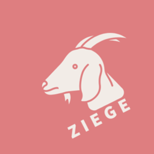

Ziege manages zig toolchains and zls releases on your system (automatically configured by a `.zigversion` in your repo root). When used as an alias (either by renaming it, or by symlink) to Zig it will seamlessly dispatch all command line arguments to the correct Zig binary for a project.

Using Ziege should be totally transparent and should be the only tool you need to setup for working with Zig.

> Development is mostly happening at [Sourcehut](https://git.sr.ht/~photex/ziege). I push to github frequently enough though and releases are hosted here for the moment because, sadly, github is where people expect to find things.

This tool was inspired by [Bazelisk](https://github.com/bazelbuild/bazelisk).

## Feature Checklist

Ziege is still in it's very early stagess but can hopefully be as useful for you as it is for me. Bug reports, feature requests, or any other sort of contribution are all greatly appreciated.

- [x] Download Zig toolchain indicated by a project `.zigversion`.
- [ ] Works on major desktop platforms.
  - [x] Windows
  - [x] Linux
  - [ ] MacOS (*Not yet tested. Help appreciated!*)
- [ ] Works on more esoteric platforms.
  - [ ] Haiku :D
- [x] Simple proxy for Zig.
  - [x] Allow zig version override with launcher args (ex: `+version=0.12.0`)
- [x] Simple proxy for Zls.
- [x] Update pinned Zig version.
- [x] List installed Zig versions.
- [x] Add Zig toolchains.
- [x] Remove Zig toolchains.
- [ ] Gracefully fail in the face of edge cases, network failures, and other problems.
- [ ] Configure a default Zig toolchain version for when a repo doesn't specify one.
- [ ] Allow configuration of alternate Zig and Zls indexes.
- [ ] Allow configuration of the location of Zig toolchains.
- [ ] Add symlinks in a repo (ex: `<repo>/tools/zig`) for folks that do not wish to use Ziege as a proxy.
- [ ] Be your one stop shop for all your Zig tool needs!

## Installing

Download a binary for your platform from one of the [releases](https://github.com/photex/ziege/releases) and place it somewhere in PATH.

```sh
wget https://github.com/photex/ziege/releases/download/v0.1.0/ziege-linux-x86_64 -O ziege
```

Make a symlink or a copy named `zig`.

```sh
ln -s ziege zig
```

And now you can use Zig as you normally would with the benefit of having toolchains automatically downloaded for you.

Currently I'm testing ziege on Windows 11 and Linux (AlmaLinux 9.4) and using it to build ziege itself. I've tested zeige with some other repositories such as [zig-gamedev](https://github.com/zig-gamedev/zig-gamedev), [sokol-zig-imgui-sample](https://github.com/floooh/sokol-zig-imgui-sample/), and the [delve-framework](https://github.com/Interrupt/delve-framework/).

> Note for cmd.exe users: For whatever reason, a symlink or copy of ziege.exe that is renamed to zig.exe or zls.exe will always get resolved as 'ziege.exe' when running the program. It only seems to affect you when you let cmd.exe resolve their location via %PATH%. If you use an absolute path to them *including the .exe file extension* then it would work.
> As a workaround for that (if you aren't willing to use pwsh/powershell) I have added two batch files to this repo that you can place somewhere in your %PATH% instead.

## Building

It's a very straight forward `zig build` situation and at this point I'm using ziege while building ziege. :D

If you build a debug version there will be some extra logging output that you wouldn't otherwise see.

## Modes

### Zig mode

In this mode, ziege is a proxy for a specific zig release. This mode is activated when ziege is named 'zig' (either via a symlink or by making a copy), or if you run ziege with the `+zig` launcher arg.

Ziege will try and determine the zig version to proxy by reading a file named `.zigversion` in the current working directory. If that is not found *ziege will use the current nightly version of zig*.

You can override this version by using a "launcher arg":

```sh
zig +version=0.12.0 build run
```

In the event you want to always use this version you can have ziege update your .zigversion file:

```sh
zig +set-version=0.12.0 build run
```

It is also possible to set the version or override `.zigversion` with the environment variable `ZIG_VERSION`. And zeige will set that env var with running zig or zls so that any call to zig as a child process that relies on finding zig in PATH will end up using the correct version (which appears to happen for 'zig build' dependencies specified as paths in build.zig.zon).

In all cases, if the resolved version isn't found then it will be downloaded first.

### Zls mode

In this mode, ziege is a proxy for the zls associated with your specified zig version. This mode is activated when ziege is named 'zls' (either via a symlink or by making a copy), or if you run ziege with the `+zls` launcher arg.

The same launcher args available to zig mode are available in zls mode by virtue of essentially being a single implementation for the proxy.

### Ziege mode

In this mode ziege offers some basic toolchain management commands.

```sh
ziege list
ziege add 0.12.0
ziege remove 0.11.0
ziege set-version 0.12.0
ziege update
ziege help
```

When using `set-version` to update your .zigversion file, the specified toolchain will be downloaded if it isn't already installed.

## How it works

When you run Ziege, it searches for a `.zigversion` file in the current working directory. If that is found the contents are read and used to locate an appropriate toolchain. In the event that no version file is present in the repo yet, Ziege will resolve the latest nightly and create a `.zigversion` for you.

If a toolchain matching the specified version isn't present on your system already, then it will be downloaded and unpacked into a standard location.

Once a toolchain is located, run Zig and forward any command line arguments to it.

### Where do we store toolchains?

At the moment we create a `ziege` folder under the AppData path for your system.

On Linux this is `$HOME/.local/share/ziege`, and on Windows this is `%USERPROFILE%\AppData\Local\ziege`

### From where do we download Zig and Zls?

We cache the release indexes and use this to resolve the current nightly version or get the url for a tagged release.

Because these indexes do not contain information for every nightly build, if a repo is pinned to a nightly build we have to derive the url for that toolchain.

#### Regarding Zls

*We only install Zls by using information in their release index. Stable versions might not line up perfectly to Zig releases as a result of the two projects being independent of each other.*

>Removing and adding a zig version would then also re-download zls, so once a matching tagged release was available you'd also then have it. I'm sure that some of this can be automated, but for the moment I think a light touch is best.

## Why is it called "Ziege"?

Ziege is the German word for Goat, it starts with the letter 'Z', and I once overheard someone talking about Zig on the train who pronounced Zig with an accent which sounded to me like *tsee-guh*. This coincidentally is how you pronouce the German word.

Ziege looks similar to the English word 'siege' and so perhaps you pronounce it *zeej*.

However you like to pronounce it is fine.
